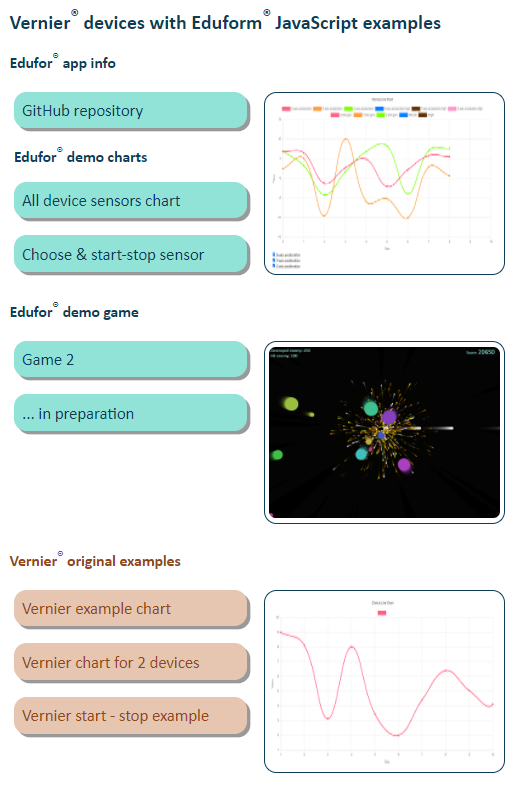

# Příklady použití čidel Vernier od Eduforu

## Jak začít s příklady:

Pro většinu příkladů jsou zde dvě možnosti:

1. Jednuše otevřít webový prohlížeč a napsat adresu - cestu k souboru "router.html" , např. C:/Vernier/test_vernier_2/public/router.html

2. Spustit html příklad pomocí *express* serveru
   - app.js spouští framework pro Node.js express server
   - nejdříve je třeba spustit si příkazovou řádku ve složce s projektem a zadat příkaz `npm install`  
   - dále spustit express server příkazem  `npm start`  
   - otevřít webový prohlížeč a napsat adresu http://localhost:8000
  
 - Některé příklady lze spustit pouze druhým způsobem

- Je třeba použít prohlížeč *Google Chrome*. Čidla Vernier neumí interagovat s většinou dalších prohlížečů.

Stránka *router.hmtl* odkazuje na kontrétní příklady:



## Příklady

### Edufor® demo grafy
- Jedná se upravené příklady grafů.
- Prvním příkladem je graf, který ukazuje 10 měření pro všechna čidla na zařízení Vernier Go Direct
- Druhý příklad umožnuje vybrat si kontrétní čidla a pomocí tlačítka start-stop začít či ukončit měření

### Edufor® demo hra - *Game 2*
- Hra Game 2 může být ovládana čidly ze zařízení GDX-FOR, GDX-ACC, GDX-HD a/nebo GDX-CART.
- Pomocí senzoru lze ovládat střelbu na nepřítele. Cílem je získat body za zásah nebo zničení nepřátel.

### Jak hrát hru *Game 2* se senzorem Vernier, např. akcelerometrem

- přilepit senzor na plastový talíř oboustrannou lepící páskou
- zapnout senzor
- otevřít si webovou stránku se hrou Game 2 viz výše
- kliknout na *Start a new game*
- ve vyskakovacím okně vybrat zařízení a potvrdit tlačítkem *Pair*
- hrát a otáčením talíře obládat hru


  
### Vernier® original příklady
- Jsou zde zahrnuté původní příklady od společnosti Vernier. Pro více příkladu se můžete podívat na https://github.com/VernierST/godirect-examples


# Javascriptové příklady pro vaše vlastní programy

## Spojit se a nahrát zařízení Vernier Go Direct 
example.html soubor
``` html
    <script src="https://unpkg.com/@vernier/godirect/dist/godirect.min.umd.js"></script>

    <p id="connection_type">
        <input type="radio" id="ble" name="type" value="1" checked>
        <label id="ble_label" for="ble">Bluetooth</label>
        <input type="radio" id="usb" name="type" value="0">
        <label id="usb_label" for="usb">USB</label><br>
    </p>
    <button id="select_device">Select Go Direct Device</button>

    <script src= "example.js"></script>
```
example.js soubor

``` javascript
const usbBtn = document.querySelector('#usb')
const usbLabel = document.querySelector('#usb_label')
const bleBtn = document.querySelector('#ble')
const bleLabel = document.querySelector('#ble_label').id
const selectDeviceBtn = document.querySelector('#select_device')
let gdxDevice

//vytvorit tlacitko k vybrani a pripojeni zarizeni
createSelectButton()

//reagovat na vybrani zarizeni
selectDeviceBtn.addEventListener('click', selectDevice)

//vytvorit tlacitko k vybrani zarizeni
function createSelectButton () {
    try {
        if (navigator.bluetooth) {
            bleLabel.innerHTML = `Bluetooth`
        } else {
            if (navigator.hid) usbBtn.checked = true
            bleLabel.innerHTML = `Bluetooth <span style="color:red">Not Supported</span> <a href="https://webbluetoothcg.github.io/web-bluetooth/">More information</a>`
            bleBtn.disabled = true
        }
        
        if (navigator.hid) {
            usbLabel.innerHTML = `USB`
        } else {
            if (navigator.bluetooth) bleBtn.checked = true
            usbLabel.innerHTML = `USB <span style="color:red">Not Supported</span> <a href="https://wicg.github.io/webhid/">More information</a>`
            usbBtn.disabled = true
        }
        
        if (!navigator.bluetooth && !navigator.hid) {
            selectDeviceBtn.style.visibility='hidden'
        } 

    } catch (err) {
        console.log(err)
        output.textContent += (err.toString())
        output.textContent += ('Try to reload page and/or switch off / switch on device.')
    }
}

//pokracovat potom, co se zarizeni pripoji
const selectDevice = async () => {
    const bluetooth = document.querySelector('input[name="type"]:checked').value === "1"
    try {

        gdxDevice.on('device-opened', () => {
            //vas kod potom, co je zarizeni vybrano a pripojeno
        }

        gdxDevice.on('device-closed', () => {
            //vas kod potom, co je zarizeni odpojeno
        })

        gdxDevice.sensors.forEach( sensor => {
            sensor.on('value-changed', (sensor) => {
               //vase funkce ke zpracovani hodnot z vybranych sensoru zarizeni
            })
        })       

    } catch (err) {
        console.error(err)

    }
}
```

## Vybrat senzory zařízení Vernier Go Direct
Defaultně jsou obvykle u zařízení zpracovávány hodnoty pouze z jednoho senzoru.

### Vybrat všechny senzory
example.js soubor
``` javascript
//k aktivace cteni hodnot ze vsech senzoru lze ze `selectDevice()` volat tuto funkci
//aktivuj cteni hodnot ze vsech senzoru tohoto zarizeni
function enableAllSensors (device) {
    try {
        device.sensors.forEach(sensor => {
            if (sensor.enabled !== true) {
                sensor.enabled = true
                sensor.emit('state-changed', sensor)
            }
        }) 

    } catch (err) {
        console.log(err)
    }
}
```

### Vybrat některé senzory zařízení
example.js soubor
``` javascript

//k aktivace cteni hodnot ze vybranych senzoru lze ze `selectDevice()` volat tuto funkci
//tento priklad vybira k mereni senzory merici X,Y and Z-axis acceleration sensors
function chooseControlSensors (device) {
    try {
        //pro kazdy senzor pripojeneho zarizeni    
        device.sensors.forEach(sensor => {

            if (sensor.name == 'X-axis acceleration' || sensor.name == 'Y-axis acceleration'  ||
                sensor.name == 'Z-axis acceleration' ){
                sensor.enabled = true
                output.textContent += sensor.name + ' enabled\n'
                sensor.emit('state-changed', sensor)
                sensor_found = true
            }
            if (sensor.name != 'X-axis acceleration' && sensor.name != 'Y-axis acceleration' && 
                sensor.name != 'Z-axis acceleration' ){
                sensor.enabled = false
                sensor.emit('state-changed', sensor)
            }
        }) 

        return device

    } catch (err) {
        console.log(err)
    }
}
```
